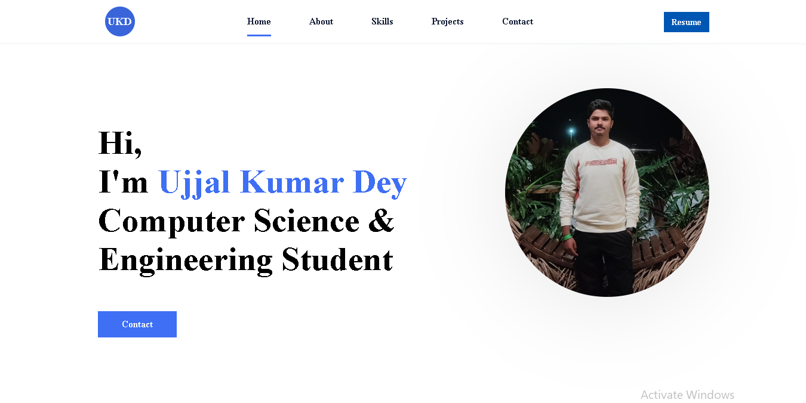
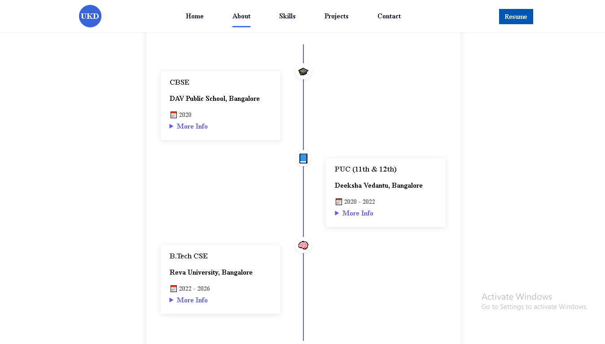
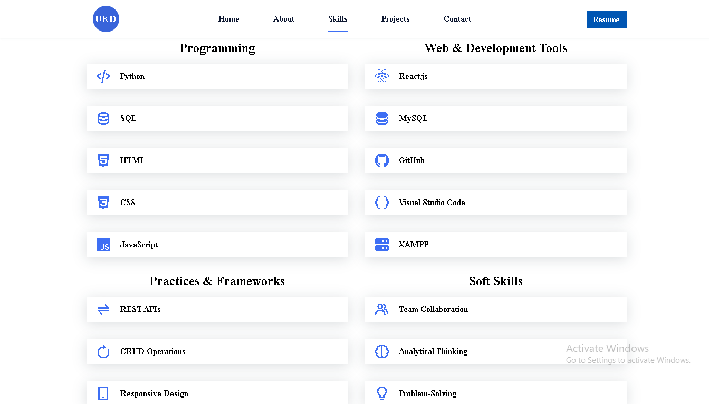
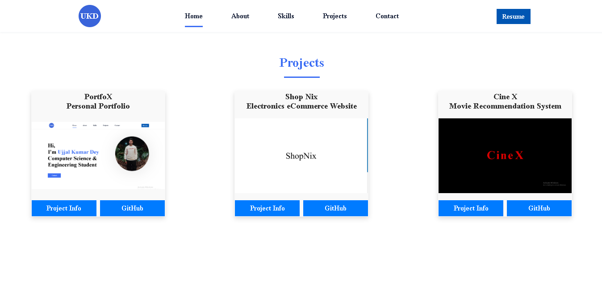
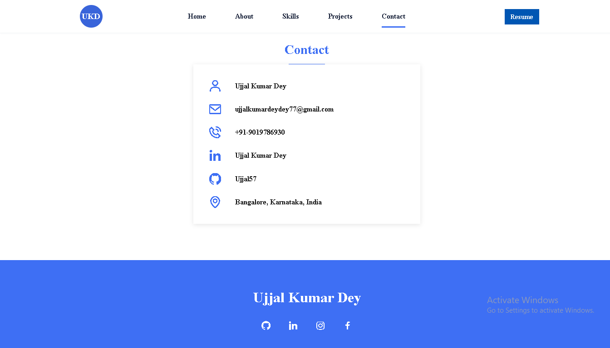

# 🌐 PortfoX – Personal Portfolio Website

A modern, responsive, and interactive personal portfolio to showcase your **skills**, **projects**, **education**, and **contact information** in an elegant and professional layout.

> ⚠️ **Note:** This repository contains only the **code structure** of the portfolio website (HTML/CSS/JS), not the complete backend or all assets. Customize it by adding your own content, images, and scripts as needed.

## 📌 Project Overview

**PortfoX** is a web-based developer portfolio designed to present your technical and personal profile in a visually engaging way. This project reflects strong frontend development, UI/UX practices, and structured content presentation, ideal for showcasing during placements and job interviews.

## 🚀 Features

- 🎨 Clean & Responsive Design (Desktop + Mobile)
- 🧑 About Section with Timeline Education
- 🛠 Skills Section – Programming, Web & Development Tools, Practices & Frameworks, Soft Skills
- 🎬 Projects Section with Image Slideshow & Modals
- 📩 Contact Information with Email, Phone, Socials
- 📄 Resume Button with Google Drive Link
- 🔄 Animated Modals and Project Viewers
- 🧠 Fully customizable content and easy to expand

---
## 📂 Folder Structure

```bash
PortfoX-Personal-Portfolio/
├── .vscode
├── assets/
│   ├── css/
│   │   └── styles.css
│   ├── img/
│   │   └── Cine X
│   │   └── portfolio
│   │   └── Shop Nix
│   └── js/
│       └── main.js
├── index.html
├── README.md
```

## 📚 How to Use / Run

### ▶️ Live Preview (Manual)

1. **Download** the project folder **or** clone it using the command below:

   ```bash
   git clone https://github.com/Ujjal57/PortfoX-Personal-Portfolio.git
   ```

2. **Navigate** to the project folder and open the `index.html` file using any modern web browser:

   - Google Chrome  
   - Mozilla Firefox  
   - Microsoft Edge  
   - Brave  

3. **Explore** the different sections:

   - Home  
   - About  
   - Skills  
   - Projects  
   - Contact  

4. **Customize** the content:

   - Edit `index.html` for text & structure  
   - Edit `assets/css/styles.css` for styling  
   - Edit `assets/js/main.js` for scroll animations  

5. ✅ **(Optional) Host on GitHub Pages**:

   - Push the repository to GitHub  
   - Go to **Settings > Pages**, select the branch as `main` and folder as `/root`  
   - Share your live portfolio link!  

## 🖼️ Screenshots
<p align="center">
  <em>Home Page</em><br>
  
</p>

<p align="center">
  <em>About Page</em><br>
  
</p>

<p align="center">
  <em>Skills Page</em><br>
  
</p>

<p align="center">
  <em>Project Page</em><br>
  
</p>

<p align="center">
  <em>Contact Page</em><br>
  
</p>

## 🛠 Tech Stack

- **Frontend**: HTML5, CSS3, JavaScript  
- **Icons**: [Boxicons CDN](https://boxicons.com/)  
- **Animations**: [ScrollReveal.js](https://scrollrevealjs.org/)  
- **Fonts**: Times New Roman (Customized) 

## 👨‍💻 Developer

**Ujjal Kumar Dey** 
